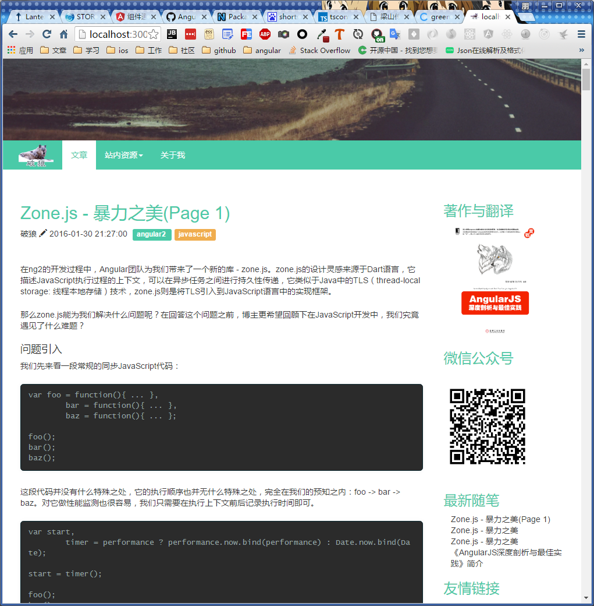
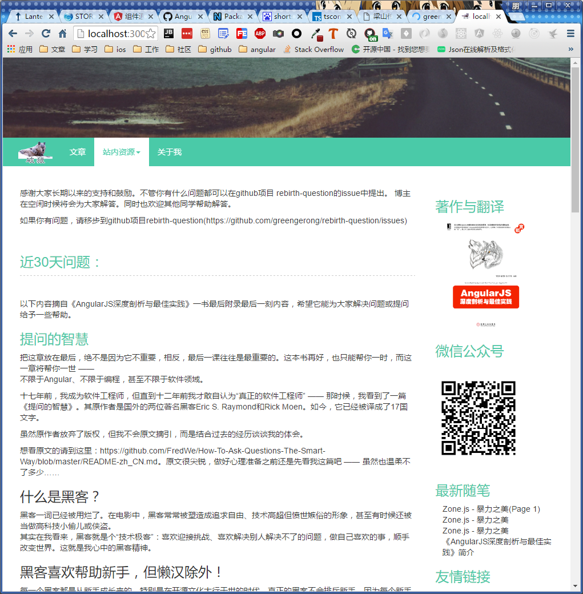
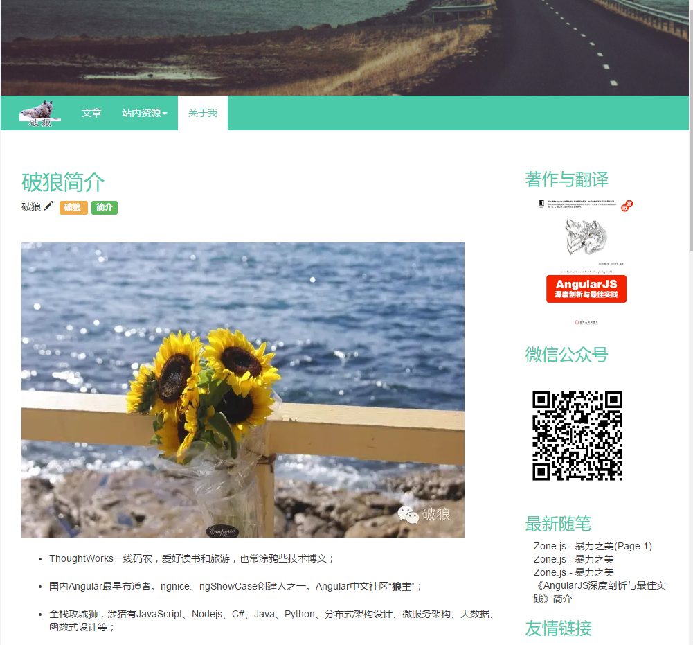
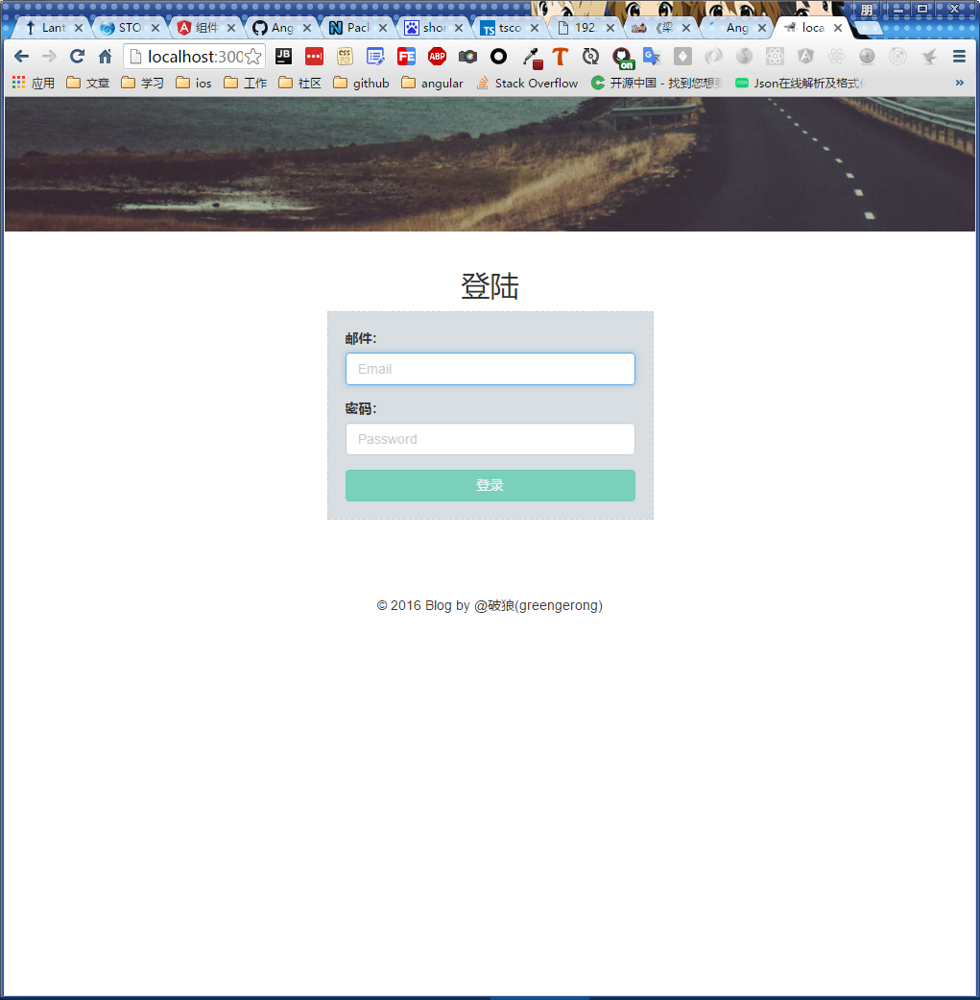
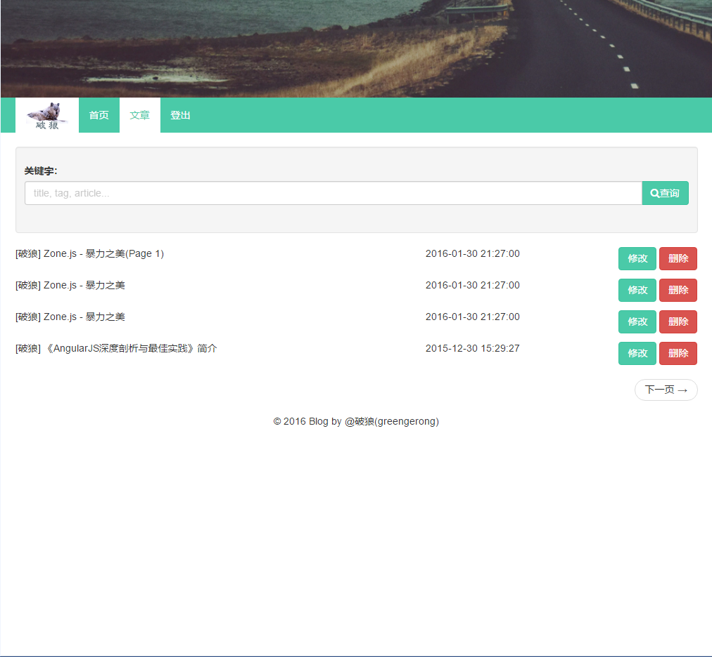
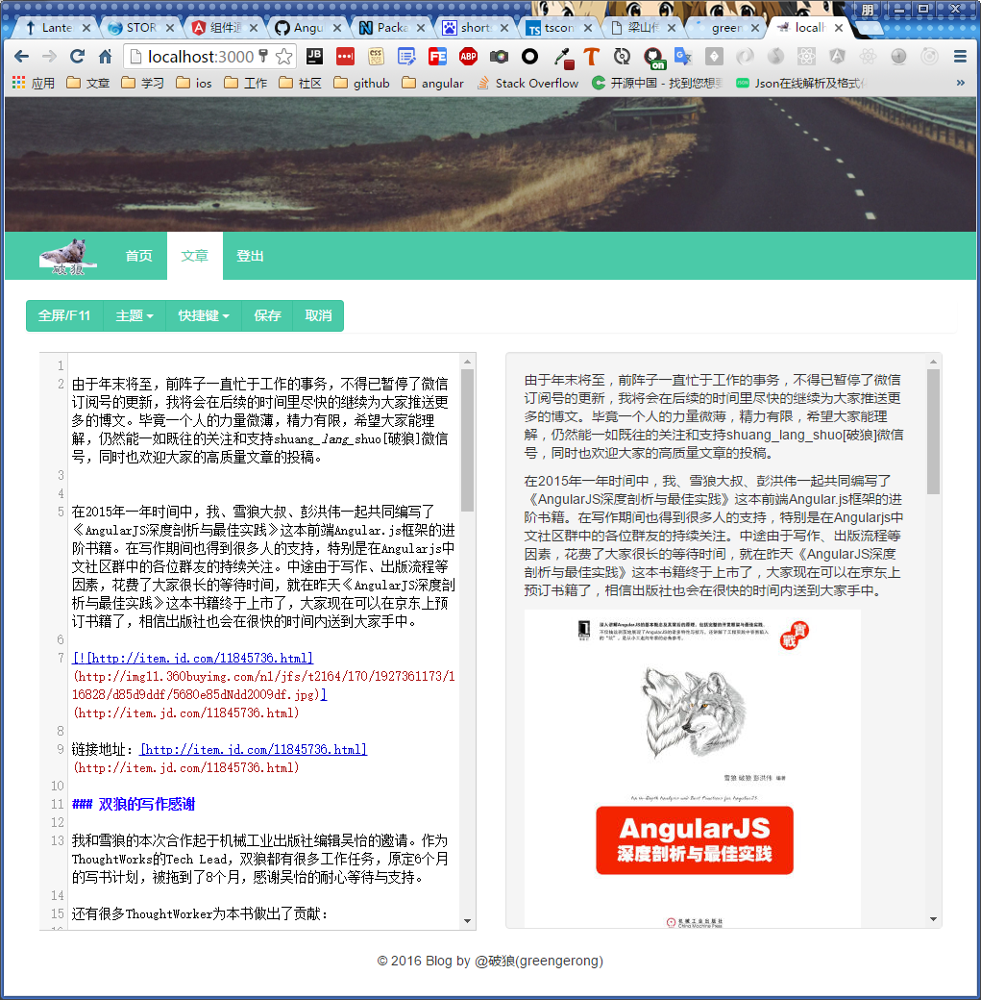
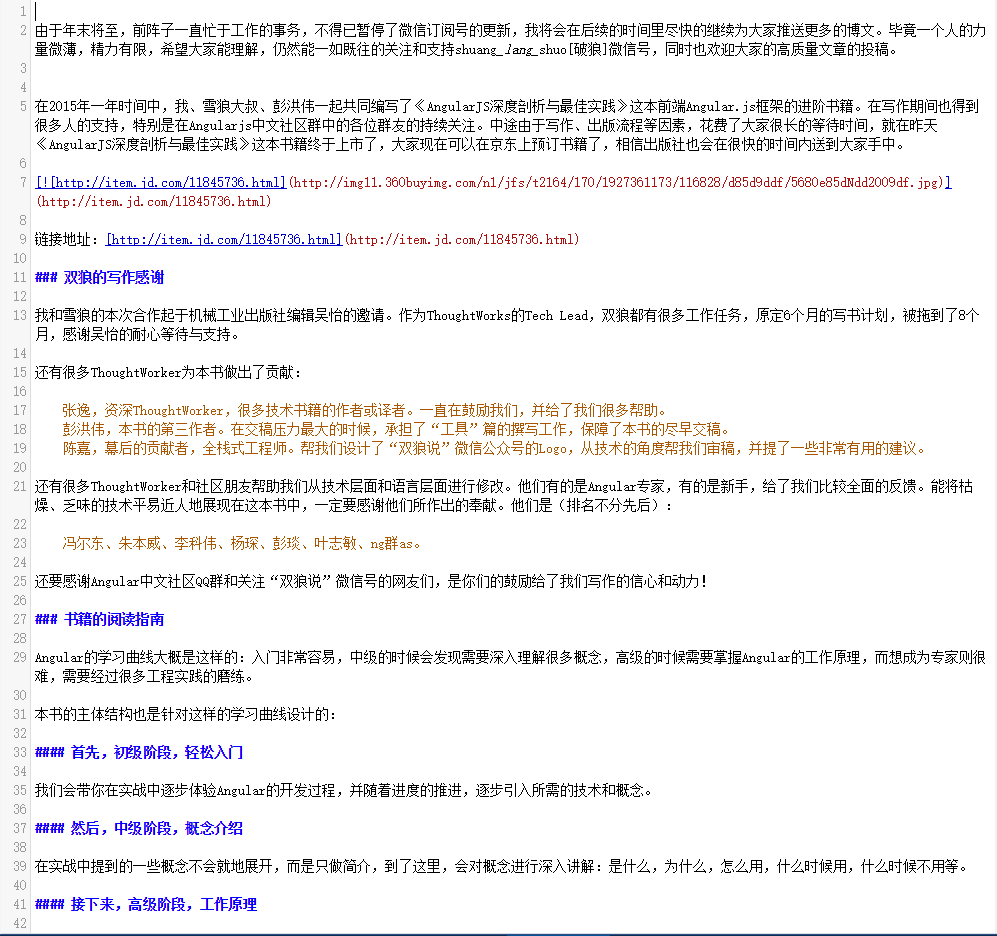

@rebirth/rebirth

==================

GreenGerong(破狼) blog with Angular2. 

## How to build this project?

### setup project

* Install Nodejs( v5 or v6)
* `npm install -g angular-cli@latest`
* `npm install`

### run project

* development: `npm run jit` & `npm run aot`
* production: `ng build --prod`
* test: `npm test`
* angular-cli command

## main dependency

* angular-cli: Angular2 cli tool.
* sass
* karma
* tslint & codelyzer
* typescript & @types
* ...

## My front end WeChat

## Web site preview

### mobile

# pc

## Blog front
### home page

### question page

### about me

## Blog manage
### login page

### blog list

### blog editor

### editor full screen

